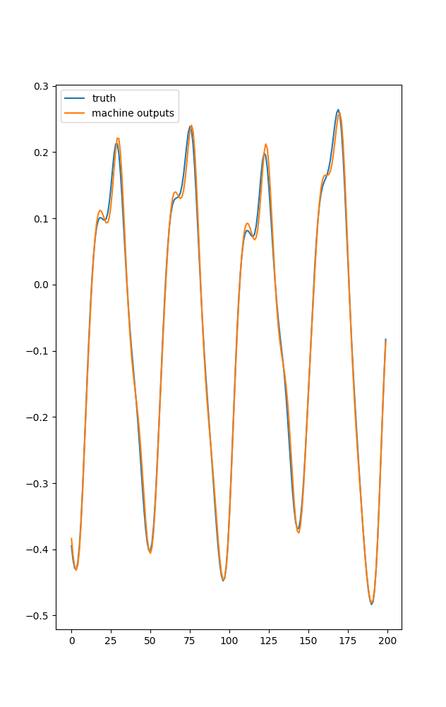
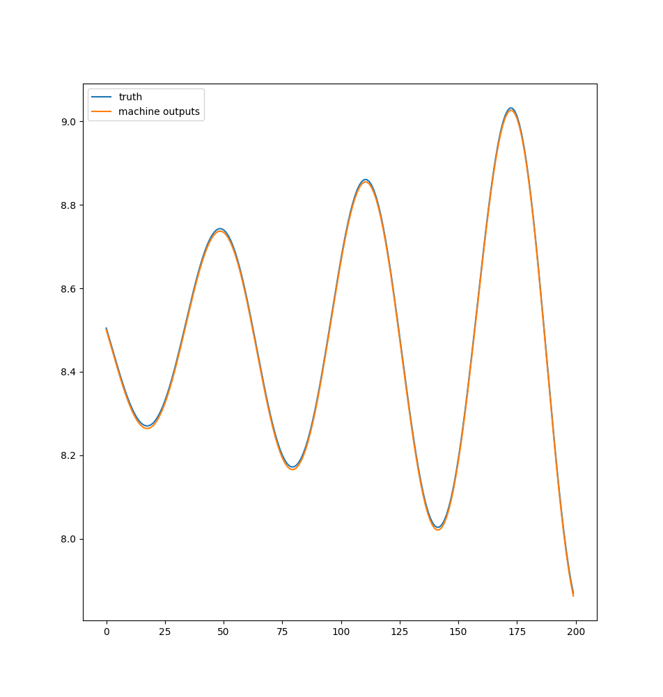
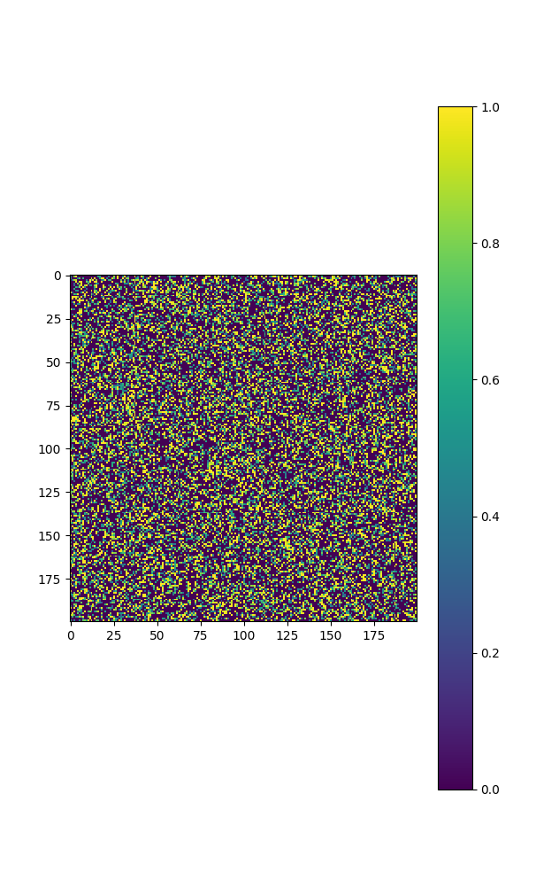

A basic Echo State Network.

Overview of Echo State Network (ESN) :
    The ESN is a resevoir computing model. 
    The basic premise of resevoir computing is that we have random input weights,
    a large "resevoir" of nodes - randomly connected to each other, and output
    weights. Basically it's a giant RNN where we only train the output weights
    to avoid the pitfalls of training RNN's.
    Basically the resevoir acts a dynamical system and we're mapping the output
    of our created dynamical system to the output system we're trying to 
    predict. At least that's my understanding of it.
    
The Code :
    This ESN module is supposed to be academic and really clear for anyone
    trying to learn how to implement an ESN. So, it's not really 
    computationally efficient but it's really clear for understanding the 
    math code going on.

Results:
I just finished the code and tried it on the Mackey Glass system data.
Here are the results with just 200 nodes and 40% node connectivity:

Another one with the lorenz system (just one observer).

And here is the sample adjacency matrix / weights matrix for the nodes
with 40% connectivity.

